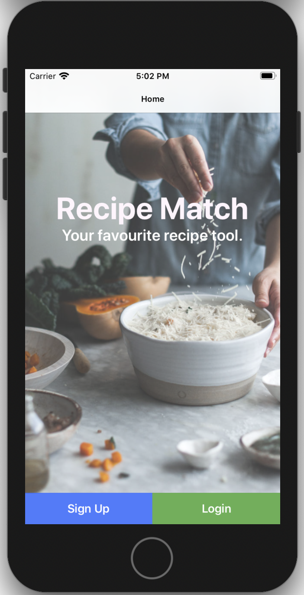
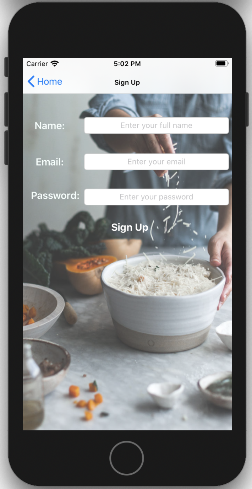
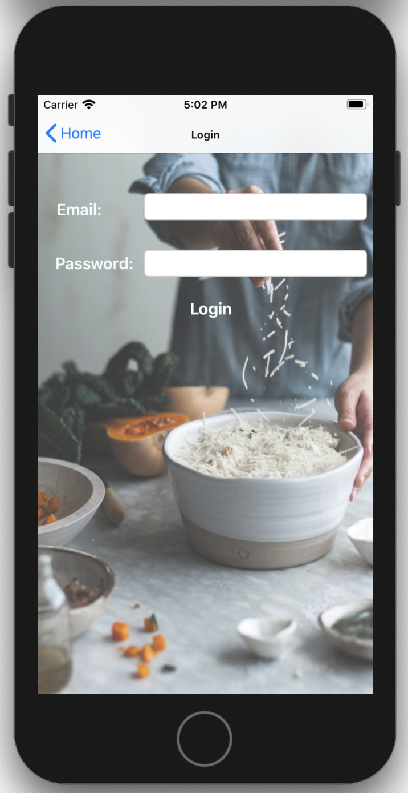
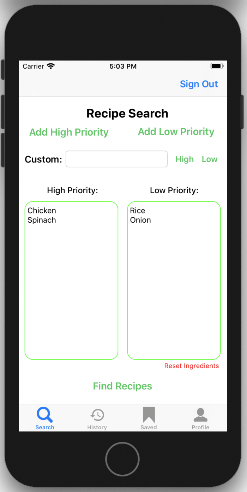
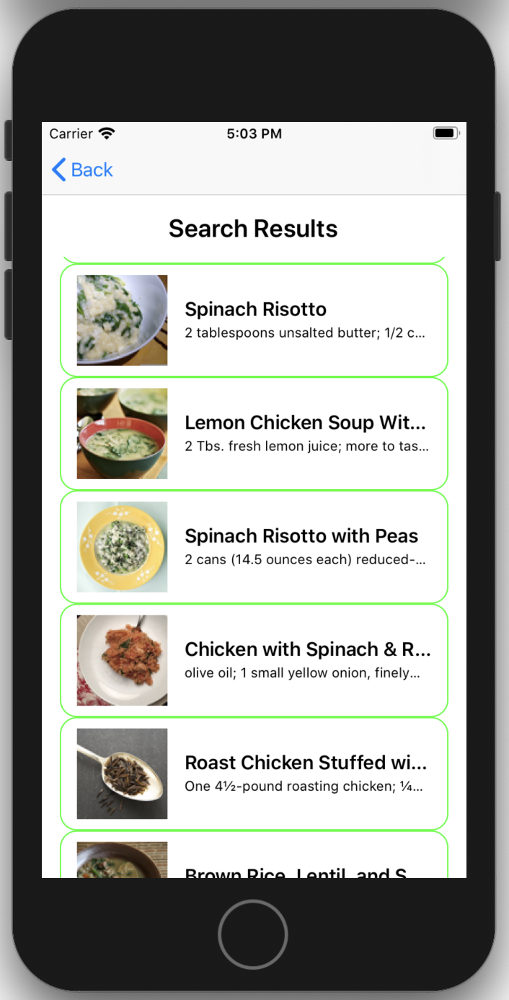
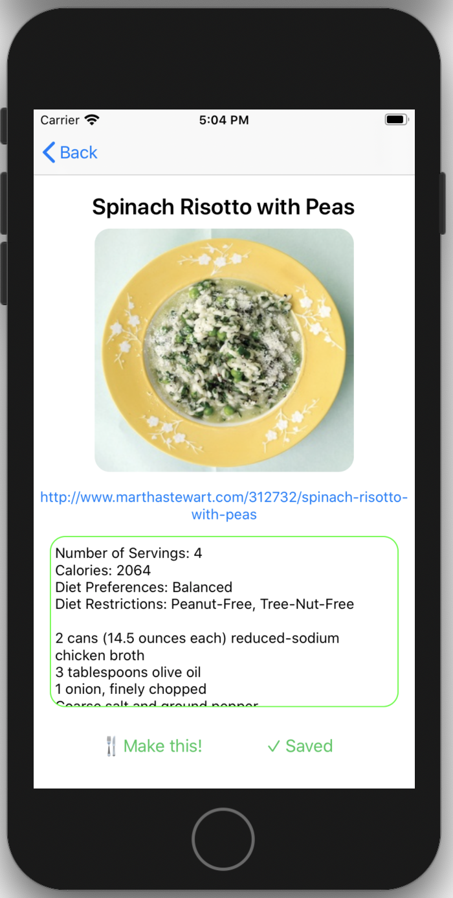
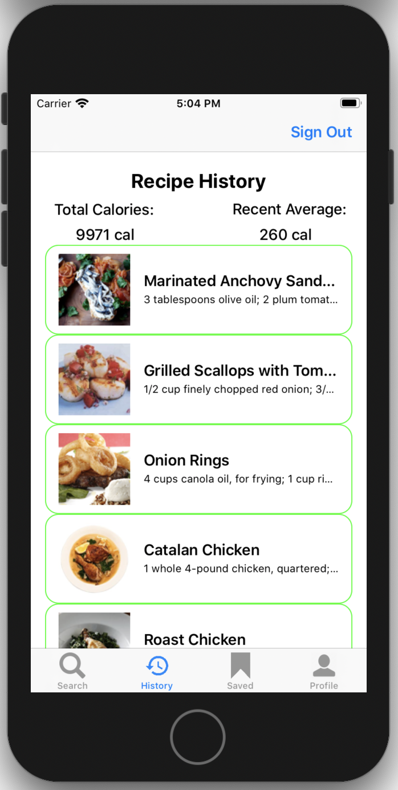
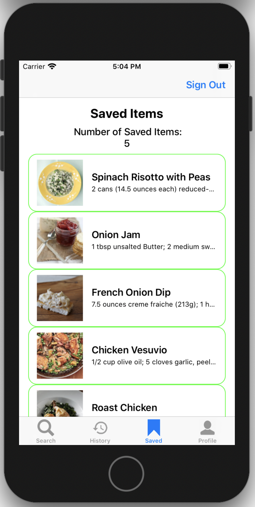
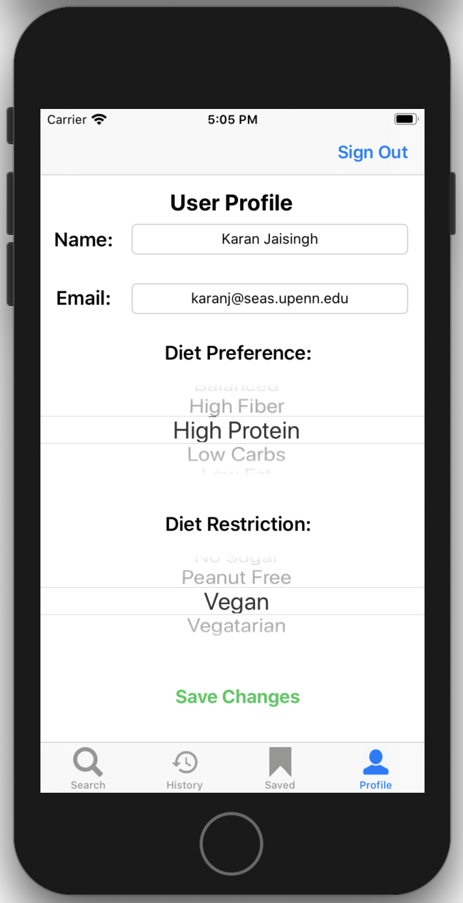
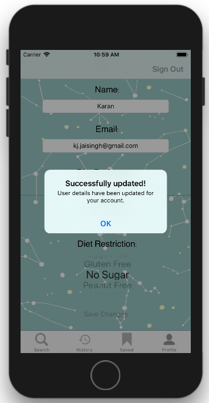

# Recipe Match
Recipe Match is an iOS application designed to aid home-cooks find recipes attuned to the ingredients they have with them, preventing excessive trips to the grocery store, cutting costs and promoting environmental sustainability.

**Features included**
* The ability to decide between high priority and low priority ingredients, based on what ingredients the user needs to finish off
* An algorithm that filters and ranks recipes based on their revelance and utilization of high & low priority ingredients
* An efficient API system that helps provide thousands of possible recipes
* The ability to mark recipes as Made or Saved
* Tracking of recent calorie consumptions for recipes Made within the last 2 weeks
* Ability to easily access both Made and Saved recipes
* A neat and efficient User Interface

**App Interface**

